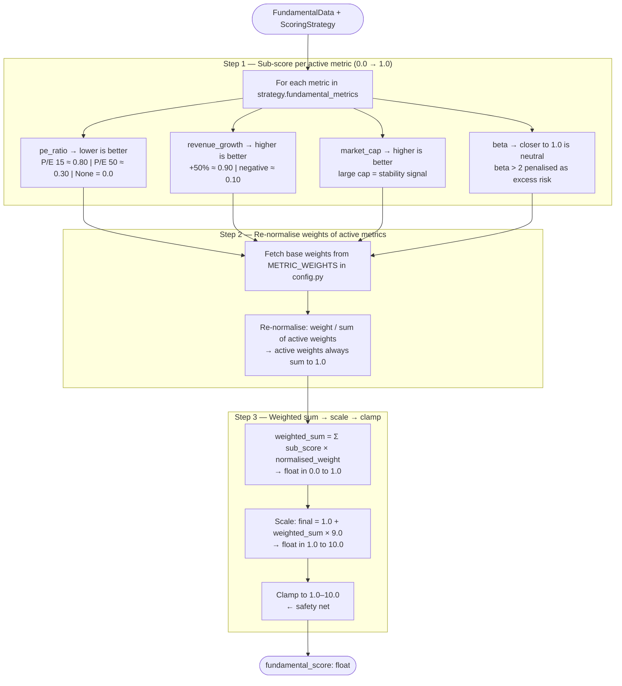
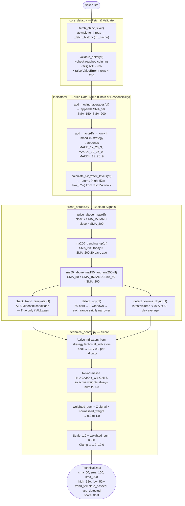
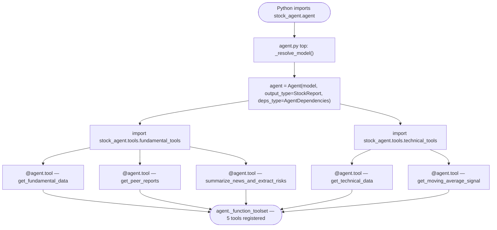
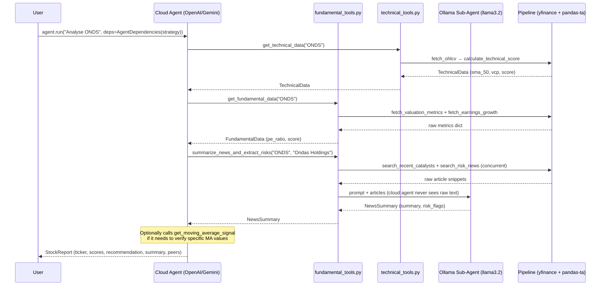

# Architecture & Data Flow Diagrams

A living document describing the data flows and component interactions of the Autonomous PydanticAI Stock Analyst Agent.
Updated as each phase is built. All diagrams use [Mermaid](https://mermaid.js.org/) and render natively on GitHub.

---

## FastAPI Server Lifecycle (`lifespan`)

The FastAPI app uses an `@asynccontextmanager` lifespan hook to manage resources that must be initialized before the server accepts any requests and torn down cleanly on shutdown.

```
server process starts
        │
        ▼
 ┌─ lifespan STARTUP ──────────────────────────────────┐
 │  • async SQLAlchemy engine created                  │
 │  • DB connection pool warmed up                     │
 │  • Tables auto-created if APP_ENV == "development"  │
 └─────────────────────────────────────────────────────┘
        │
        ▼
 server is reachable — clients can POST /analyze
        │
        ▼
 ┌─ lifespan SHUTDOWN ─────────────────────────────────┐
 │  • engine.dispose() — all DB connections closed     │
 │  • Redis connections released                       │
 └─────────────────────────────────────────────────────┘
        │
        ▼
server process exits
```

**Why lifespan over `@app.on_event("startup")`:** `on_event` is deprecated in FastAPI 0.93+. The `lifespan` context manager is the current standard — it co-locates startup and shutdown logic, and works correctly with pytest's `AsyncClient` test fixture.

**Defined in:** `src/stock_agent/db/session.py` (Step 40) — imported and passed to `FastAPI(lifespan=lifespan)` in `api.py`.

**Module ownership:** The FastAPI app, lifespan hook, all request models, and every route handler live exclusively in `src/stock_agent/api.py`. No route definitions exist in any other module. This keeps a clean separation:

| Module | Responsibility |
|---|---|
| `agent.py` | PydanticAI agent, tool registration, `run_analysis()` |
| `api.py` | FastAPI app, lifespan, request models, all route handlers |
| `main.py` | CLI — argparse, `asyncio.run()` |

---

## Phase 2 — Fundamental Data Pipeline

### Web Search Flow (`web_search.py`)

How a single ticker input becomes a rich set of deduplicated, categorised news snippets.


**Key design decisions:**
- `asyncio.gather()` fires all queries concurrently — no sequential blocking
- Each query uses `asyncio.to_thread()` internally to offload the blocking DuckDuckGo HTTP call to a thread pool, keeping the event loop free
- `max_results=5` per query — keeps each query focused; avoids generic coverage drowning out specific signals
- `_deduplicate()` removes snippets that appear in multiple query results (e.g. a major earnings event surfaces across several queries simultaneously) — prevents the downstream Ollama NLP agent from wasting context window tokens on repeated information
- Current year injected via `datetime.now().year` — never hardcoded — ensures results are always recent

---

---

## Phase 2 — Fundamental Scoring Pipeline

### Scoring Algorithm Flow (`fundamental_scorer.py`)

How a `FundamentalData` object and `ScoringStrategy` become a single score in `[1.0, 10.0]`.



**Why re-normalise weights?**
If a strategy only activates `pe_ratio` (base weight 0.4), re-normalising it to `1.0` ensures the score still spans the full `[1.0, 10.0]` range. Without re-normalisation, the maximum possible score would be artificially capped at `1.0 + 0.4 × 9.0 = 4.6` — penalising focused strategies unfairly.

**Sub-score vs weight — two independent concerns:**
- **Sub-score** answers: *"how good is this metric's value?"* → always `0.0` to `1.0`
- **Weight** answers: *"how much do we care about this metric?"* → re-normalised to sum to `1.0`

The raw value (e.g. P/E = 15) never flows through to the final score directly — it is always converted to a sub-score first.

---

---

## Phase 3 & 4 — Technical Data Pipeline

### Full Technical Pipeline Flow

How a ticker symbol becomes a `TechnicalData` object with a score in `[1.0, 10.0]`.



---

### Chain of Responsibility — DataFrame Enrichment

Each module appends its columns and passes the same DataFrame forward. No module fetches data independently — all read from the single enriched object.

```
fetch_ohlcv()                    → Open, High, Low, Close, Volume
  → add_moving_averages()        → + SMA_50, SMA_150, SMA_200
      → add_macd()               → + MACD_12_26_9, MACDs_12_26_9, MACDh_12_26_9
          → boolean checks       →   read all columns above, return True/False
              → calculate_technical_score()  → TechnicalData with score
```

**Why this pattern:**
- No module needs to know where prior columns came from
- Nothing is fetched or computed twice
- Adding a new indicator = add a new module, append to the chain — no other file changes

---

### `lru_cache` on `_fetch_history`

`_fetch_history` is decorated with `@lru_cache(maxsize=128)`. It is the only function cached because:
1. It is the sole source of blocking HTTP I/O — caching at this layer prevents all redundant network calls
2. `lru_cache` requires a plain `def` — it cannot wrap `async def` functions

The cache is **process-level** (shared across all users for the lifetime of the server process). Primary use case: peer analysis runs where the same ticker may be requested multiple times within a single analysis. Production upgrade path: replace with `cachetools.TTLCache` to add staleness expiry.

---

### Technical Scoring — Weight Re-normalisation

Mirrors the fundamental scorer's approach. Only indicators listed in `strategy.technical_indicators` are active. Their base weights (from `INDICATOR_WEIGHTS` in `config.py`) are re-normalised so they always sum to 1.0:

```
Default INDICATOR_WEIGHTS:
  trend_template: 0.5
  vcp:            0.3
  macd:           0.1
  moving_averages: 0.1

Strategy: ["trend_template", "vcp"] only
  active total = 0.5 + 0.3 = 0.8
  re-normalised:
    trend_template: 0.5 / 0.8 = 0.625
    vcp:            0.3 / 0.8 = 0.375
                               ──────
                                1.000 ✓
```

A strategy with only `["trend_template"]` produces the same score regardless of VCP result — VCP is not in scope, its weight is zero.

---

---

## Phase 5 — Agent Assembly & Tool Registration

### Tool Registration Flow

How `@agent.tool` decorators wire tools onto the agent at import time, and why imports are deferred to the bottom of `agent.py`.



**Why imports are at the bottom of `agent.py`:**
Tool files import `agent` from `agent.py`. If `agent.py` also imported tool files at the top, Python would try to import the tool files before `agent` was defined — circular import. Bottom-of-file imports defer the tool registration until after `agent` exists in memory.

---

### Agent Run — Tool Call Flow

How the cloud LLM calls tools during a single `agent.run()` invocation.



**Key architectural constraint:**
The cloud agent receives only structured, pre-computed outputs — `TechnicalData`, `FundamentalData`, `NewsSummary`. Raw article text, OHLCV DataFrames, and intermediate calculations never appear in the cloud model's context window.

---

### Heavy vs Lightweight Tool — Decision Boundary

```
get_technical_data("ONDS")          ← Heavy: full pipeline, called once
  ↓
TechnicalData(trend_template=False, score=4.0)

Agent reasoning: "Why did trend_template fail? Is it a near-miss or a real breakdown?"

get_moving_average_signal("ONDS")   ← Lightweight: one fetch + one calculation
  ↓
{price: 10.75, sma_50: 10.99}       ← 2.2% below SMA-50 = near-miss

Agent conclusion: "Near-miss on trend template — not a structural breakdown."
```

Without the lightweight tool, the agent re-runs the full pipeline or reasons blindly from the boolean.

---

*More diagrams will be added as phases are built.*
