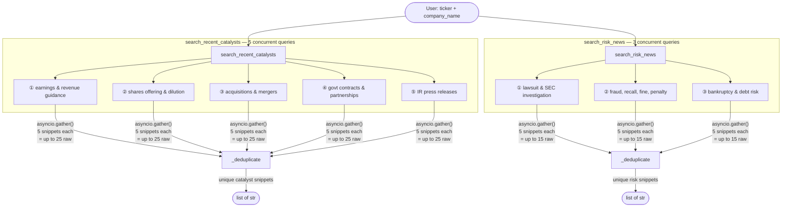

# Architecture & Data Flow Diagrams

A living document describing the data flows and component interactions of the Autonomous PydanticAI Stock Analyst Agent.
Updated as each phase is built. All diagrams use [Mermaid](https://mermaid.js.org/) and render natively on GitHub.

---

## Phase 2 — Fundamental Data Pipeline

### Web Search Flow (`web_search.py`)

How a single ticker input becomes a rich set of deduplicated, categorised news snippets.

**Key design decisions:**
- `asyncio.gather()` fires all queries concurrently — no sequential blocking
- Each query uses `asyncio.to_thread()` internally to offload the blocking DuckDuckGo HTTP call to a thread pool, keeping the event loop free
- `max_results=5` per query — keeps each query focused; avoids generic coverage drowning out specific signals
- `_deduplicate()` removes snippets that appear in multiple query results (e.g. a major earnings event surfaces across several queries simultaneously) — prevents the downstream Ollama NLP agent from wasting context window tokens on repeated information
- Current year injected via `datetime.now().year` — never hardcoded — ensures results are always recent

---

---

## Phase 2 — Fundamental Scoring Pipeline

### Scoring Algorithm Flow (`fundamental_scorer.py`)

How a `FundamentalData` object and `ScoringStrategy` become a single score in `[1.0, 10.0]`.

**Why re-normalise weights?**
If a strategy only activates `pe_ratio` (base weight 0.4), re-normalising it to `1.0` ensures the score still spans the full `[1.0, 10.0]` range. Without re-normalisation, the maximum possible score would be artificially capped at `1.0 + 0.4 × 9.0 = 4.6` — penalising focused strategies unfairly.

**Sub-score vs weight — two independent concerns:**
- **Sub-score** answers: *"how good is this metric's value?"* → always `0.0` to `1.0`
- **Weight** answers: *"how much do we care about this metric?"* → re-normalised to sum to `1.0`

The raw value (e.g. P/E = 15) never flows through to the final score directly — it is always converted to a sub-score first.

---

*More diagrams will be added as phases are built.*
