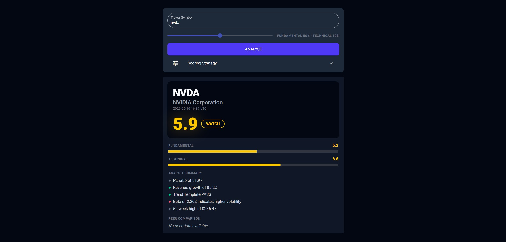
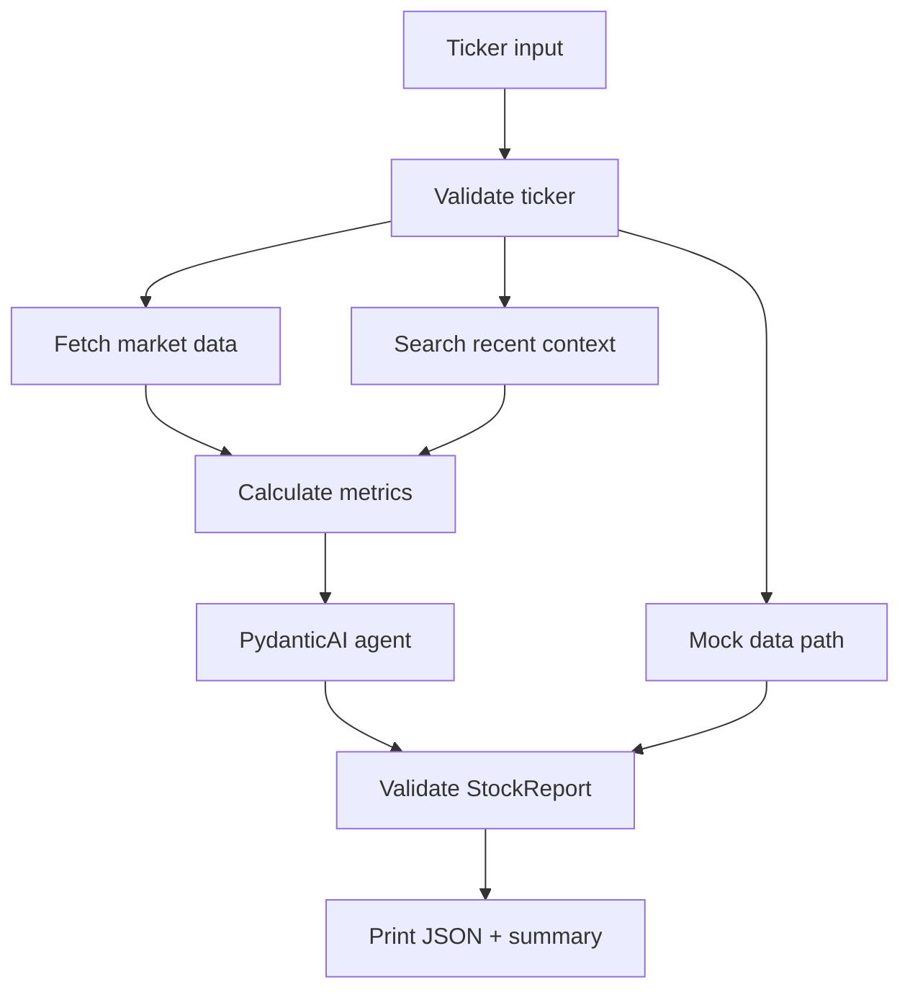

# Pydantic Stock Agent

A PydanticAI stock research demo that gathers market context, runs deterministic calculations, and returns a validated structured `StockReport`. It is a technical demo of agentic reasoning with typed outputs, not financial advice.



## Table of Contents

- [What It Demonstrates](#what-it-demonstrates)
- [Quickstart](#quickstart)
- [Web UI](#web-ui)
- [Demo](#demo)
- [Architecture](#architecture)
- [Output Schema](#output-schema)
- [How The Agent Works](#how-the-agent-works)
- [For Interviewers](#for-interviewers)
- [Tests](#tests)
- [Disclaimer](#disclaimer)
- [Limitations](#limitations)
- [Next Improvements](#next-improvements)

## What It Demonstrates

- PydanticAI agent orchestration
- Tool calling for market data, technical indicators, peers, and news context
- Typed Pydantic output with schema validation
- Deterministic score calculation before LLM reasoning
- JSON output plus a human-readable CLI summary
- Mock mode for reproducible demos without API keys

## Quickstart

```bash
uv sync
uv run stock-agent --ticker NVDA --mock
```

Convenience path:

```bash
python demo.py --ticker NVDA --mock
```

Real mode requires provider credentials in `.env`:

```bash
cp .env.example .env
uv run stock-agent --ticker AAPL
```

## Web UI

Run the NiceGUI site locally:

```bash
uv run python -m stock_agent.ui.app
```

Then open `http://localhost:8080`.

## Demo

Mock mode prints a validated JSON report followed by a compact summary.

```bash
uv run stock-agent --ticker NVDA --mock
```

```json
{
  "ticker": "NVDA",
  "company_name": "NVIDIA Corporation",
  "current_price": 123.45,
  "market_summary": "NVIDIA Corporation is shown in mock mode with strong growth context, constructive technical posture, and valuation risk kept visible.",
  "fundamental_score": 7.4,
  "technical_score": 8.2,
  "weighted_score": 7.8,
  "calculation": "(7.4 x 0.50) + (8.2 x 0.50) = 7.8",
  "risks": ["Valuation could compress if growth expectations cool."],
  "sources": ["mock://market-data/nvda"],
  "confidence": "medium",
  "recommendation": "BUY"
}
```

Full transcript: [docs/demo-transcript.md](docs/demo-transcript.md)

## Architecture



## Output Schema

The top-level result is `stock_agent.models.report.StockReport`.

```python
class StockReport(BaseModel):
    ticker: str
    company_name: str
    current_price: float | None
    analysis_date: datetime
    market_summary: str
    fundamental_score: float
    technical_score: float
    weighted_score: float
    calculation: str
    key_points: list[KeyPoint]
    recommendation: Literal["BUY", "WATCH", "AVOID"]
    risks: list[str]
    sources: list[str]
    confidence: Literal["low", "medium", "high"]
    peers: list[PeerReport]
```

## How The Agent Works

1. Validates and normalizes the ticker.
2. Gathers stock, peer, technical, and news context through tools.
3. Computes all numerical scores in deterministic Python code.
4. Sends pre-computed context to the PydanticAI agent for final reasoning.
5. Validates the result against `StockReport`.
6. Prints both JSON and a short summary.

The core rule: the LLM reasons over pre-computed data, but never computes indicators or scores itself.

## For Interviewers

- CLI entry point: `src/stock_agent/cli.py`
- Mock data: `src/stock_agent/mock_data.py`
- Agent definition: `src/stock_agent/agent.py`
- Output model: `src/stock_agent/models/report.py`
- Tests: `tests/test_cli_demo.py`

## Tests

```bash
uv run pytest -q
```

The demo-focused tests cover ticker validation, mock data shape, Pydantic validation, JSON serialization, and CLI mock mode without API keys.

## Disclaimer

This project is a technical demo of agentic research, deterministic calculations, and structured output. It is not financial advice.

## Limitations

- Market data freshness depends on the active provider.
- LLM summaries may be incomplete or miss context from source data.
- Mock mode uses static sample data and should not be interpreted as current market analysis.
- Real mode requires configured model credentials and may depend on network availability.

## Next Improvements

- Add source URLs from every real-mode tool result.
- Expand mock fixtures for several tickers and recommendations.
- Add GitHub Actions for fresh-clone test verification.
- Add Docker once the CLI demo path is fully stable.
